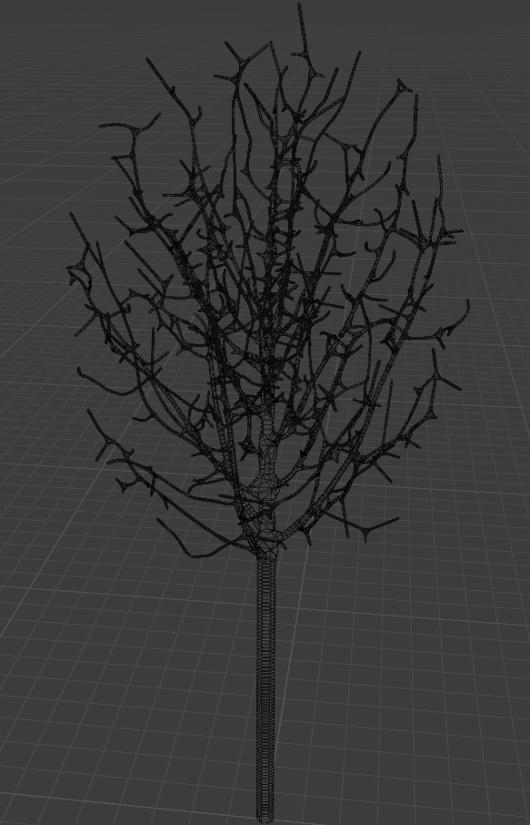

# TBO-Tree-Gen

This add-on for Blender 2.8+ creates trees procedurally by implementing a space colonialization algorithm.

---
**Warning: This project is still in a pre-release stage.**

This means it may not be fully production ready. If you:

- encounter any bugs
- feel like a feature is missing
- have another idea how to further improve the project

let me know your feedback through the [Issues](https://github.com/TheBeautifulOrc/TBO-Tree-Gen/issues) page of this repository.

---

## Features

The main advantages of this add-on compared to most other tree generation add-ons for Blender are:

- **Control:** The user is in total control of the shape and size of the tree. Defining the overall shape of the tree and tweaking minor details are clearly separated workflows and will not interfere with one another.
- **Realism:** Since the trees which are grown by this add-on emulate the natural process of competing for space, they will look organic and be free of artifacts like intersecting branches.
- **Multiple Trees:** With this workflow multiple trees can be "grown" into one single interconnected shape without clipping into each other (i.e. a hedge consisting of multiple individual plants).
- **Quad-dominance:** The meshes generated by this add-on are quad-dominant and should behave nicely when further processing or rendering them.
- **Speed:** All the "heavy lifting" in this add-on is done in C++. This ensures high efficiency and cuts down on processing time and memory consumption, making it viable to create complex trees even on low-end machines.

## Installation

1. Head to the [Releases](https://github.com/TheBeautifulOrc/TBO-Tree-Gen/releases) page and download the repository **with compiled C++ binaries** as a .zip-file.
2. Open Blender 2.8+.
3. Go to `Edit -> Preferences -> Add-ons` and click the `Install` button in the top-right corner.
4. Select the downloaded .zip-file and you're done.

## Usage

Please head over to the [wiki](https://github.com/TheBeautifulOrc/TBO-Tree-Gen/wiki/User-guide) for detailed instructions.

## Building

If you want to build this project yourself instead of using the pre-compiled releases, head to the [wiki](https://github.com/TheBeautifulOrc/TBO-Tree-Gen/wiki/Building) for detailed instructions.

## Acknowledgements

This project could have never been realized without the theoretical foundations laid by others. The following papers have been crucial in its development:

- Runions, A. and Lane, B. and Prusinkiewicz, P. (2007), *Modeling Trees with a Space Colonization Algorithm*. Eurographics Workshop on Natural Phenomena.
- Ji, Z. and Liu, L. and Wang, Y. (2010), *B-Mesh: A Fast Modeling System for Base Meshes of 3D Articulated Shapes*. Computer Graphics Forum 29(7), pp.2169-2178.
- Barber, C. B. and Dobkin, D. P. and Huhdanpaa, H. (1996), *The Quickhull Algorithm for Convex Hulls*. Association for Computing Machinery 22(4), pp.469-483.